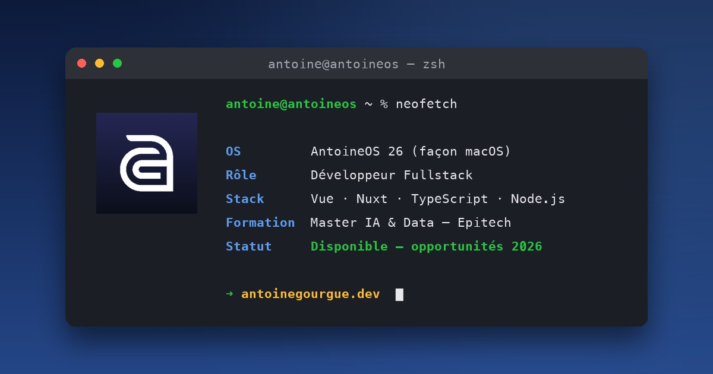

# antoinegourgue.dev — a macOS-style portfolio

My personal portfolio, built as a **hand-coded macOS clone** — and a full **iOS experience on mobile**. No template, no UI kit: every window, icon and interaction is custom.



## The concept

The site behaves like a real Mac:

- **Menu bar** with working dropdown menus, keyboard shortcuts (`⌘1-5`, `⌘K`, `T`), live clock and sound toggle
- **Desktop** with draggable windows (About panel, live Terminal), double-clickable desktop icons and a right-click context menu (wallpaper switcher included)
- **Dock** with the real magnification effect (size-based, not scale — icons stay crisp), running indicators, bounce on click and minimized windows
- **Functional traffic lights** on every window: close/minimize animate into the dock, green opens the matching page
- **Spotlight** (`⌘K`): fuzzy search across pages, projects and actions
- **Boot screen** on every page load (server-rendered — zero flash), with a synthesized startup chime

On mobile, the site turns into an **iPhone**: iOS status bar, springboard home screen with live widgets (calendar + real weather), app grid, iOS dock, and fullscreen apps with native-style navigation bars.

## Real apps, really working

| App            | What it does                                                                                                                                |
| -------------- | ------------------------------------------------------------------------------------------------------------------------------------------- |
| **App Store**  | My projects as full product pages — live GitHub stars, categories, screenshots, and my Digitaleo apprenticeship as a case study             |
| **Messages**   | An iMessage clone running my home-made intent-based chatbot (FR/EN/ES, language detection)                                                  |
| **Weather**    | Real forecast for the visitor's location (open-meteo + IP/GPS geolocation), hourly + 6-day views with Apple-style range bars                |
| **Calculator** | Fully functional — macOS tiles on desktop, iOS round buttons on mobile                                                                      |
| **Contacts**   | My background as an address book (Digitaleo, Epitech, schools) with deep links                                                              |
| **Calendar**   | My journey as filterable, clickable colored events                                                                                          |
| **Notes**      | Real first-person notes (how this site is built, what I learn at Digitaleo) + press mentions, with folders, pinned notes and working search |
| **Mail**       | The actual contact form (honeypot + SMTP) styled as a compose window                                                                        |

Every UI sound (clicks, whooshes, sent-mail swoosh, boot chord) is **synthesized with Web Audio** — zero audio files.

## Stack

- **Nuxt 3** (SSR) · Vue 3 · TypeScript
- **Tailwind CSS** — design tokens, responsive macOS/iOS split
- **GSAP** — Draggable windows, dock physics, ScrollTrigger reveals
- **i18n** — French, English, Spanish
- Icons: hand-drawn SVGs + [Framework7 Icons](https://framework7.io/icons/) (MIT) · Weather icons: [Meteocons](https://github.com/basmilius/weather-icons) (MIT)
- Deployed on Vercel

## Run it

```bash
npm install
npm run dev      # http://localhost:3000
npm run build    # production build
```

Environment: `VITE_GITHUB_TOKEN` (live GitHub stats) and SMTP variables for the contact form.

---

Built by [Antoine Gourgue](https://antoinegourgue.dev) — fullstack developer, Anglet 🇫🇷
